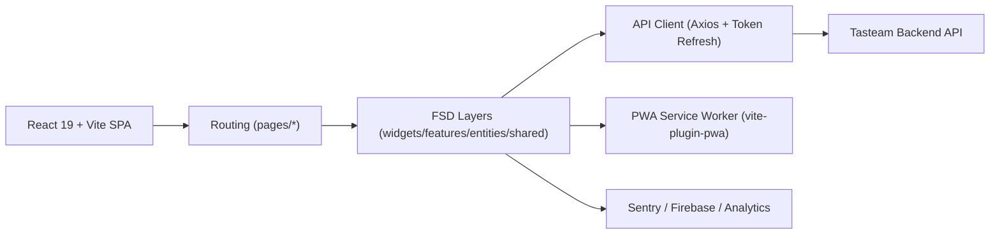

# Tasteam Frontend

> 팀/조직 단위 음식 경험 데이터를 바탕으로, 점심 메뉴 의사결정을 빠르게 만드는 PWA 프론트엔드

## 1. Project Overview

Tasteam Frontend는 모바일 중심 사용성을 고려해 설계된 웹 앱(PWA)입니다.  
팀 구성원 리뷰, 즐겨찾기, 검색, 그룹 단위 활동 데이터를 한 화면에서 연결해 "오늘 어디서 먹을지" 결정 시간을 줄이는 데 초점을 둡니다.

- Service: [https://tasteam.kr](https://tasteam.kr)
- Frontend Wiki: [Frontend Wiki](https://github.com/100-hours-a-week/3-team-tasteam-wiki/wiki/Frontend-Wiki)
- Backend Wiki: [Backend Wiki](https://github.com/100-hours-a-week/3-team-tasteam-wiki/wiki/Backend-Wiki)

## 2. Key Features

- OAuth 기반 로그인/회원 인증 플로우
- 그룹/하위그룹 단위 식당 탐색 및 가입 플로우(이메일/비밀번호)
- 식당 검색, 상세 조회, 리뷰 작성/조회
- 개인/그룹 즐겨찾기 관리
- 실시간 채팅 UI 및 알림 센터
- 오늘의 점심, 이벤트/공지, 마이페이지/설정
- PWA 기반 설치형 UX 및 오프라인 대응 캐싱

## 3. Architecture



### Directory Snapshot

```text
src/
├── app/        # Bootstrap, providers, router
├── pages/      # Route-level pages
├── widgets/    # Large composed UI blocks
├── features/   # User-facing features
├── entities/   # Domain-centric model/ui/api
└── shared/     # Reusable api/lib/ui/config/styles
```

## 4. Getting Started

### Prerequisites

- Node.js 20+
- npm 10+

### Install & Run

```bash
npm install
cp .env.example .env.local
npm run dev
```

- Default URL: `http://localhost:3000`
- Backend API (local): `http://localhost:8080`

### Build & Quality

```bash
npm run build
npm run lint
npm run format
npm run preview
```

## 5. Environment Variables

주요 값은 `.env.example` 기준으로 관리합니다.

| Key                 | Description               |
| ------------------- | ------------------------- |
| `VITE_APP_URL`      | 프론트 앱 도메인          |
| `VITE_API_BASE_URL` | 백엔드 API 주소           |
| `VITE_FIREBASE_*`   | FCM 설정                  |
| `VITE_ACTIVITY_*`   | 사용자 이벤트 수집 설정   |
| `VITE_SENTRY_*`     | 클라이언트 에러 추적 설정 |

세부 정책: [`docs/환경-변수/README.md`](./docs/환경-변수/README.md)

## 6. Documentation Hub

- 온보딩: [`docs/QUICK-START.md`](./docs/QUICK-START.md)
- 기술 선정: [`docs/기술-선정/README.md`](./docs/기술-선정/README.md)
- 디렉터리 구조(FSD): [`docs/디렉토리-구조/README.md`](./docs/디렉토리-구조/README.md)
- 개발 규칙: [`docs/개발-규칙/README.md`](./docs/개발-규칙/README.md)
- 디자인 시스템: [`docs/디자인-시스템/README.md`](./docs/디자인-시스템/README.md)
- API 명세(연동 기준): [`docs/API-명세/API.md`](./docs/API-명세/API.md)

## 7. Release & Collaboration

- Branch 전략: `main`, `develop`, `feat/*`, `refactor/*`, `hotfix/*`
- 사전 품질 게이트: Husky + lint-staged
- 커밋/브랜치 컨벤션: 팀 공통 규약 기반 운영

---

이 문서는 초안(draft)입니다.  
실서비스 기준 스크린샷, 사용자 시나리오 GIF, 성능 지표(LCP/CLS) 섹션은 다음 리비전에서 추가를 권장합니다.
