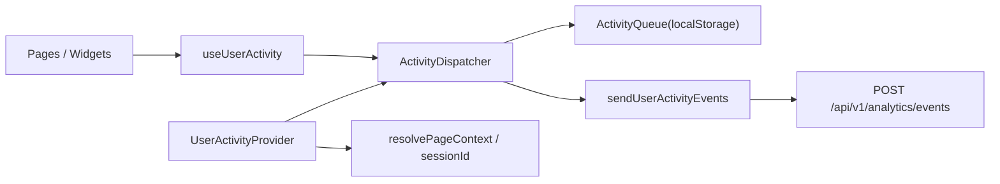
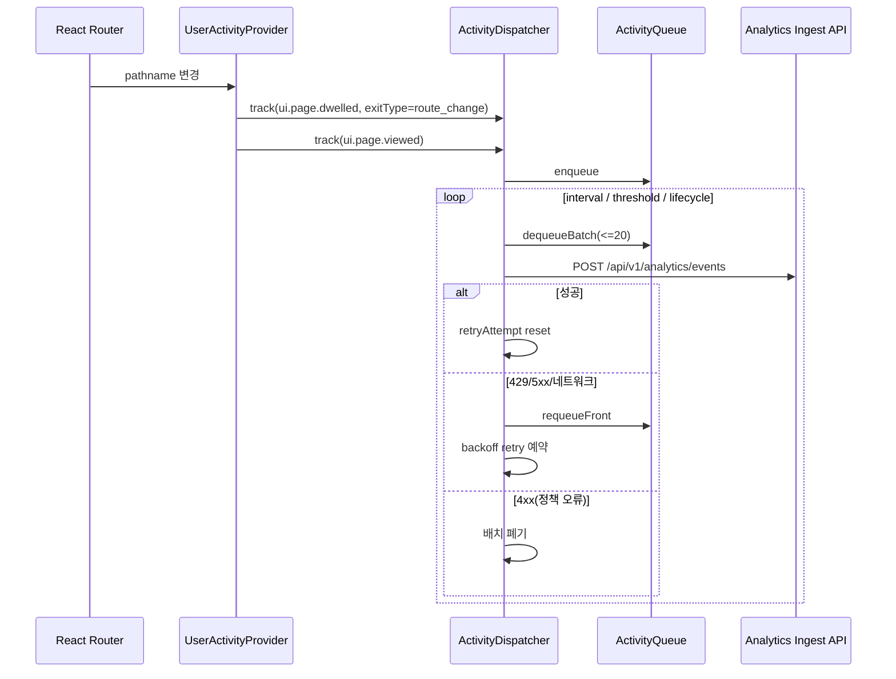

# 사용자 이벤트 수집(User Activity Collection) - FE 구현 문서

## 1) 배경과 목표

### 1-1. 배경

- 백엔드에는 `POST /api/v1/analytics/events` ingest 파이프라인이 이미 구현되어 있다.
- 프론트엔드에서 페이지 방문/체류/핵심 클릭 이벤트를 일관되게 수집할 공통 계층이 필요하다.
- 네트워크 실패/오프라인에서도 이벤트를 유실하지 않도록 큐 기반 전송이 필요하다.

### 1-2. 목표

- `tasteam-fe` 전역에서 재사용 가능한 이벤트 수집 모듈(`entities/user-activity`) 제공
- 핵심 이벤트(`ui.page.*`, `ui.restaurant.*`, `ui.review.*`, `ui.search.executed`, `ui.tab.changed` 등) 1차 계측
- 배치 전송/재시도/오프라인 복구/PII 최소 수집 정책 반영

### 1-3. 범위 / 비범위

- 범위:
  - 페이지 진입/체류 이벤트 자동 수집
  - 핵심 화면 액션 이벤트 수집
  - 로컬 큐 + 주기 플러시 + 재시도
  - 익명/인증 사용자 공통 ingest 전송
- 비범위:
  - 전 화면/전 요소 자동 계측
  - 분석 대시보드/집계 리포트
  - 이벤트 스키마 자동 버전 마이그레이션

## 2) 모듈 구조

### 2-1. 패키지와 책임

| 경로                                                        | 책임                                          |
| ----------------------------------------------------------- | --------------------------------------------- |
| `src/entities/user-activity/model/types.ts`                 | 이벤트/트래커 공개 타입 계약                  |
| `src/entities/user-activity/model/eventCatalog.ts`          | 이벤트명 allowlist 및 필수 properties 검증    |
| `src/entities/user-activity/model/session.ts`               | sessionId, path template, pageKey 해석        |
| `src/entities/user-activity/model/anonymousId.ts`           | 익명 식별자 생성/보관                         |
| `src/entities/user-activity/model/activityQueue.ts`         | 메모리 + localStorage 큐 관리                 |
| `src/entities/user-activity/api/userActivityIngestApi.ts`   | ingest API 호출 및 상태 분류                  |
| `src/entities/user-activity/model/activityDispatcher.ts`    | 배치 flush, 재시도(backoff), 독성 배치 폐기   |
| `src/entities/user-activity/model/UserActivityProvider.tsx` | 라우트 page view/dwell 자동 수집 및 전역 주입 |
| `src/entities/user-activity/model/useUserActivity.ts`       | 앱 레이어/화면 레이어에서 트래커 사용         |

### 2-2. 의존 경계

- `app/pages/widgets`는 `@/entities/user-activity` public API만 사용한다.
- `entities/user-activity`는 `shared` 계층(`env`, `routes`, `logger`, `authToken`)만 의존한다.
- 라우트/화면은 이벤트 생성만 하고, 네트워크/재시도/큐 정책은 디스패처에 위임한다.

### 2-3. 아키텍처 다이어그램

## 3) 런타임 흐름

### 3-1. 페이지 이벤트 자동 수집

### 3-2. 수집 정책

- 이벤트 기본 공통값:
  - `eventVersion = "v1"`
  - `properties.source = "CLIENT"`
  - `properties.platform = "WEB"`
  - `properties.appEnv = APP_ENV`
- 큐 정책:
  - 저장 키: `activity:queue:v1`
  - 큐 최대: `VITE_ACTIVITY_MAX_QUEUE_SIZE` (기본 500)
  - 배치 크기: `VITE_ACTIVITY_MAX_BATCH_SIZE` (기본 20)
- 플러시 트리거:
  - 주기 flush
  - 큐 임계치 도달
  - `visibilitychange(hidden)`, `pagehide`, `beforeunload`, `online`

## 4) 설정 계약(Configuration Contract)

| 키                                | 기본값  | 설명                     |
| --------------------------------- | ------- | ------------------------ |
| `VITE_ACTIVITY_ENABLED`           | `true`  | 활동 이벤트 수집 활성화  |
| `VITE_ACTIVITY_FLUSH_INTERVAL_MS` | `10000` | 주기 flush 간격          |
| `VITE_ACTIVITY_MAX_BATCH_SIZE`    | `20`    | 요청 당 이벤트 최대 건수 |
| `VITE_ACTIVITY_MAX_QUEUE_SIZE`    | `500`   | 로컬 큐 최대 적재 건수   |
| `VITE_ACTIVITY_DEBUG`             | `false` | 디버그 로그 출력 여부    |

추가 공개 API:

- `API_ENDPOINTS.analyticsEvents = '/api/v1/analytics/events'`

## 5) 확장 및 마이그레이션 전략

### 5-1. 신규 이벤트 추가

1. `TrackEventName`에 이벤트명 추가
2. `eventCatalog.ts`에 필수 properties 스키마 추가
3. 계측 포인트(페이지/위젯)에서 `track()` 호출 추가
4. 백엔드 ingest allowlist 동시 반영

### 5-2. 이벤트 안전성 확장

- 필요 시 `ActivityDispatcher`에서 이벤트 우선순위(critical/best-effort) 큐 분리
- 필요 시 서버 429 패턴에 맞춰 backoff 상한/지터 정책 조정

### 5-3. PII 정책 유지

- 원문 텍스트/주소/전화/이미지 URL 같은 키는 `sanitizeProperties` 단계에서 제거
- 화면 계측 코드에서는 ID/카운트/불리언/길이 지표만 전달

## 6) 리뷰 체크리스트

- `UserActivityProvider`가 라우트 진입마다 `ui.page.viewed` 1건을 생성하는가
- 페이지 이탈/hidden/unload에서 `ui.page.dwelled`가 가시 시간 기준으로 생성되는가
- 큐 최대치 초과 시 oldest drop이 동작하는가
- 429/5xx/네트워크 오류 시 재시도, 4xx 정책 오류 시 폐기가 분리되는가
- `X-Anonymous-Id` 및 인증 토큰 헤더가 요구사항대로 전송되는가
- PII 금지 키가 실제 payload에서 제거되는가

## 7) 현재 구현 상태 (2026-02-20 기준)

### 7-1. 구현 완료 항목

- `entities/user-activity` 공통 모듈 생성 완료
- 앱 전역 Provider 주입 완료 (`AppProviders`)
- 라우트 기반 `ui.page.viewed` / `ui.page.dwelled` 자동 수집 완료
- 핵심 액션 이벤트 계측 완료:
  - `ui.restaurant.clicked`
  - `ui.restaurant.viewed`
  - `ui.review.write_started`
  - `ui.review.submitted`
  - `ui.search.executed`
  - `ui.group.clicked`
  - `ui.favorite.sheet_opened`
  - `ui.favorite.updated`
  - `ui.event.clicked`
  - `ui.tab.changed`
- FE 환경변수/엔드포인트 계약 반영 완료
- BE ingest allowlist 1차 이벤트 목록 확장 반영 완료

### 7-2. 이벤트별 구현 매핑

| 이벤트명                   | 구현 위치                                                     |
| -------------------------- | ------------------------------------------------------------- |
| `ui.page.viewed`           | `src/entities/user-activity/model/UserActivityProvider.tsx`   |
| `ui.page.dwelled`          | `src/entities/user-activity/model/UserActivityProvider.tsx`   |
| `ui.restaurant.clicked`    | `src/app/router/AppRouter.tsx`                                |
| `ui.restaurant.viewed`     | `src/pages/restaurant-detail/RestaurantDetailPage.tsx`        |
| `ui.review.write_started`  | `src/pages/restaurant-detail/RestaurantDetailPage.tsx`        |
| `ui.review.submitted`      | `src/pages/write-review/WriteReviewPage.tsx`                  |
| `ui.search.executed`       | `src/pages/search/SearchPage.tsx`                             |
| `ui.group.clicked`         | `src/app/router/AppRouter.tsx`                                |
| `ui.favorite.sheet_opened` | `src/pages/restaurant-detail/RestaurantDetailPage.tsx`        |
| `ui.favorite.updated`      | `src/pages/restaurant-detail/RestaurantDetailPage.tsx`        |
| `ui.event.clicked`         | `src/app/router/AppRouter.tsx`, `src/pages/home/HomePage.tsx` |
| `ui.tab.changed`           | `src/widgets/bottom-tab-bar/BottomTabBar.tsx`                 |

## 8) 변경 파일 요약

### 8-1. FE 신규 파일

- `src/entities/user-activity/api/userActivityIngestApi.ts`
- `src/entities/user-activity/index.ts`
- `src/entities/user-activity/model/UserActivityContext.ts`
- `src/entities/user-activity/model/UserActivityProvider.tsx`
- `src/entities/user-activity/model/activityDispatcher.ts`
- `src/entities/user-activity/model/activityQueue.ts`
- `src/entities/user-activity/model/anonymousId.ts`
- `src/entities/user-activity/model/eventCatalog.ts`
- `src/entities/user-activity/model/session.ts`
- `src/entities/user-activity/model/types.ts`
- `src/entities/user-activity/model/useUserActivity.ts`

### 8-2. FE 수정 파일

- `src/app/providers/AppProviders.tsx`
- `src/app/router/AppRouter.tsx`
- `src/pages/home/HomePage.tsx`
- `src/pages/search/SearchPage.tsx`
- `src/pages/events/EventsPage.tsx`
- `src/pages/restaurant-detail/RestaurantDetailPage.tsx`
- `src/pages/write-review/WriteReviewPage.tsx`
- `src/features/search/SearchGroupCarousel.tsx`
- `src/widgets/bottom-tab-bar/BottomTabBar.tsx`
- `src/shared/config/routes.ts`
- `src/shared/config/env.ts`
- `.env.example`
- `.env.production.example`

### 8-3. BE 연동 수정 파일

- `app-api/src/main/resources/application.yml`
- `app-api/src/main/java/com/tasteam/domain/analytics/ingest/AnalyticsIngestProperties.java`

## 9) 검증 결과

- FE `npm run lint`: 통과 (기존 경고만 존재, 신규 오류 없음)
- FE `npm run build`: 통과
- FE `npm run check:fsd`: 통과
- BE `./gradlew :app-api:test --tests com.tasteam.domain.analytics.ingest.ClientActivityIngestServiceTest`: 통과

## 10) 알려진 제한사항 / 후속 TODO

- `ui.search.executed`는 `queryLength`만 수집하며 검색 원문은 수집하지 않는다(의도된 PII 정책).
- 일부 클릭 이벤트의 `position`은 화면 맥락상 계산이 어려운 경우 `-1`로 기록된다.
- 현재 백엔드 저장 컬럼 `source`는 코드상 `SERVER` 고정이므로, 1차 분석에서는 `properties.source=CLIENT`를 기준으로 FE 이벤트를 분리한다.
