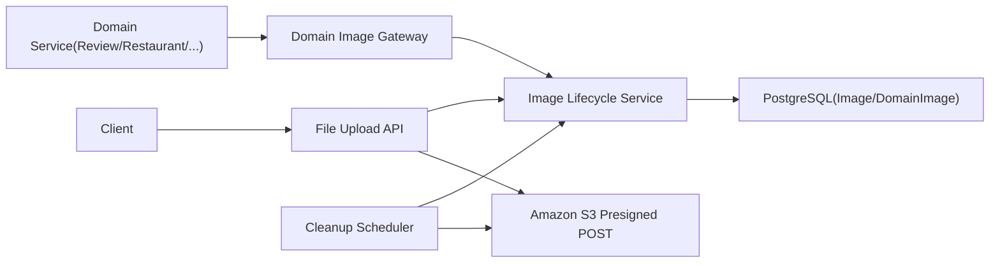
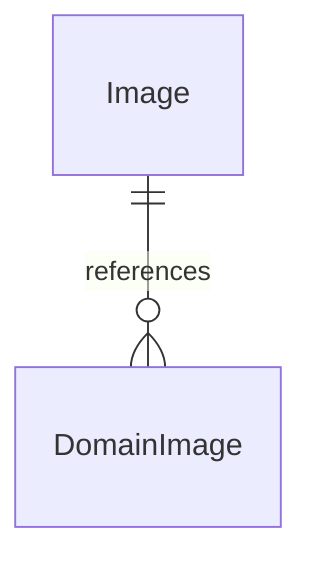

| 항목         | 내용                                                                                                                                                          |
| ------------ | ------------------------------------------------------------------------------------------------------------------------------------------------------------- |
| 문서 제목    | File 모듈 테크 스펙                                                                                                                                           |
| 문서 목적    | File 모듈 단위에서 구현/리뷰/테스트를 진행할 수 있도록 Presigned URL 기반 파일 업로드·생명주기·정리 <br> 정책을 명시하여 다른 도메인에서 재사용 가능하게 한다 |
| 작성 및 관리 | Tasteam File Squad                                                                                                                                            |
| 최초 작성일  | 2026.01.21                                                                                                                                                    |
| 최종 수정일  | 2026.01.21                                                                                                                                                    |
| 문서 버전    | v1.0                                                                                                                                                          |

<br>

# File - BE 테크스펙

---

# **[1] 배경 (Background)**

## **[1-1] 프로젝트 목표 (Objective)**

File 모듈은 Review/Restaurant/기타 도메인의 업로드-저장 흐름과 무관하게 Presigned URL 기반 업로드, 상태 추적, 정리 정책을 책임져 도메인이 파일 정책을 재사용하도록 한다.

- **핵심 결과 (Key Result) 1:** Presigned URL 발급 API p95 latency ≤ 300ms(p95) / 500 concurrent 요청 하에서 유지.
- **핵심 결과 (Key Result) 2:** Image 테이블의 `PENDING` 상태 비율을 0.5% 이하로 유지하고, 24시간 이내 정리 메커니즘을 통해 오브젝트 누적을 방지.
- **핵심 결과 (Key Result) 3:** Review, Restaurant, Promotion 등 최소 3개 도메인이 File 모듈 API만 사용하여 파일을 연결(도메인별 업로드 로직 0%)한다.

<br>

## **[1-2] 문제 정의 (Problem)**

- 도메인별 이미지 엔티티에 업로드/상태/정리 정책을 섞으면 Review/Restaurant마다 로직이 중복되고 업로드 방식 전환 시 전체 도메인 구조를 바꿔야 한다.
- Presigned URL을 도입하려면 업로드 시점과 도메인 저장 시점의 연계/미사용 이미지 정리가 필요하지만, 기존 구조에는 이미지 생명주기를 표현할 수 있는 개념이 없다.
- 도메인 추가/변경 시 이미지 정책이 일관되지 않거나 운영(Soft Delete, TTL) 요구사항을 잠재적으로 누락하는 위험이 있다.

<br>

## **[1-3] 가설 (Hypothesis)**

File에 대한 메타데이터·상태·정리 책임을 독립된 도메인(Image) 하나로 중앙집중화하면 도메인은 그저 `fileUuid`만 전달하도록 간소화되고, 결과적으로 업로드 방식 교체/미사용 이미지 정리/Soft Delete를 하나의 경로에서 일관되게 운영할 수 있다.

<br>

---

# **[2] 목표가 아닌 것 (Non-goals)**

**이번 작업에서 다루지 않는 내용:**

- 특정 도메인의 미디어 UI/정렬 노출, 앵커/화면 전환 로직 처리
  - File 모듈의 책임은 오직 파일 객체(메타/상태/정리)이며 도메인 표현은 각 도메인에서 담당한다.
- 파일 타입별 인코딩/압축(동영상 트랜스코딩, 실시간 리사이징)
  - 파일 저장은 S3 presigned + existing jobs로 유지하고, 전처리는 별도 파이프라인에서 처리한다.
- 이미지 교체/수정(업데이트)
  - 이미지 변경 요구는 기존 Image 삭제 + 신규 업로드 + DomainImage 재연결로 처리한다.
- 도메인 내부의 엔티티 조작, 승인 흐름, 도메인 비즈니스 상태 머신
  - File 모듈은 `fileUuid`를 도메인이 제공할 때만 상태를 `ACTIVE`로 전환하고 그 외 로직은 다루지 않는다.

---

# **[3] 설계 및 기술 자료 (Architecture and Technical Documentation)**

## **[3-1] 모듈 구성 및 의존성**

- 모듈/책임 요약:
  - `File Upload API (Controller)` : 파일 메타데이터/목적을 수신하고 Image 생성 → Presigned POST 반환
  - `Image Lifecycle Service` : Image 상태(PENDING→ACTIVE→DELETED) 전환, 정리 스케줄, 도메인 연결 유효성 검증
  - `Domain Image Gateway` : 각 도메인에서 받은 `fileUuid`와 도메인 식별자를 `DomainImage`로 Persist + `Image` 상태 업데이트
  - `Storage Adapter (S3)` : Presigned POST 서명 생성, ACL/Expires 설정
  - `Cleanup Scheduler` : 배치 처리로 `deleted_at IS NOT NULL AND status=PENDING` 이미지 메타·S3 Object 제거
- 주요 의존성:
  - PostgreSQL (Image, DomainImage, 상태 트랜잭션)
  - Amazon S3 (Presigned POST, Object TTL)
  - Scheduler/Job (Spring Scheduler 또는 Quartz) + Redis(중복 링크 트래킹, cleanup backoff)
  - CloudWatch/Datadog (latency, PENDING 누적 알람)
- 핵심 흐름(요약):
  - Presigned 요청 → Image(PENDING) 생성 + 외부 UUID(`file_uuid`, fileUuid) 발급(동시에 `storage_key`에 UUID 기반 key 생성) → S3 Presigned 발급 → 클라이언트 업로드
  - 도메인이 `fileUuid` 전달 → DomainImage 저장 + Image 상태 `ACTIVE`
  - scheduler로 `deleted_at IS NOT NULL AND status=PENDING` rows 추출 → S3 cleanup → Image 상태 `DELETED`
- 이미지 변경 정책: Image 메타/파일은 immutable, 변경 필요 시 삭제 + 신규 업로드 + 재연결



<br>

## **[3-2] 데이터베이스 스키마 (ERD)**

- ERD 링크/이미지: Tasteam 공통 ERD Cloud 참조 (https://www.erdcloud.com/d/TXZ3CApePpKwEyacT)
- DDL: Image, DomainImage 두 개 테이블 중심 (아래 정의 참조)
- 참고: Tasteam 기본 ERD 링크는 고정값 사용
  - ERD Cloud: [](https://www.erdcloud.com/d/TXZ3CApePpKwEyacT)
  - ERD 테이블 정의서: [ERD 테이블 정의서](https://github.com/100-hours-a-week/3-team-tasteam-wiki/wiki/%5BERD%5D-%ED%85%8C%EC%9D%B4%EB%B8%94-%EC%A0%95%EC%9D%98%EC%84%9C)

**주요 테이블 요약**

- `Image`: 실제 파일 메타/상태/스토리지 키 저장, 외부와 공유되는 UUID `file_uuid`(fileUuid)를 포함하여 도메인과 독립
- `DomainImage`: 도메인별 `fileUuid` 연결, 정렬 순서/연결 시간 기록

**관계 요약**

- `DomainImage.image_id -> Image.id (N:1, 도메인 삭제 시 DomainImage 제거 후 Image는 deleted_at만 설정하고 배치 삭제)`

**ERD(Mermaid, 선택)**



**테이블 정의서**

#### `Image`

| 컬럼          | 타입           | Nullable | 기본값                    | 설명                                                                                       | 제약/고려사항                                                  |
| ------------- | -------------- | -------- | ------------------------- | ------------------------------------------------------------------------------------------ | -------------------------------------------------------------- |
| `id`          | `bigint`       | N        | `nextval('image_id_seq')` | 파일 식별자                                                                                | `PK`, `UNIQUE`                                                 |
| `file_name`   | `varchar(256)` | N        | -                         | 원본 파일명                                                                                | 길이 256                                                       |
| `file_size`   | `bigint`       | N        | -                         | 바이트 단위 크기                                                                           | 양수                                                           |
| `file_type`   | `varchar(64)`  | N        | -                         | MIME 타입                                                                                  | `ENUM`(`image/jpeg`,...)                                       |
| `storage_key` | `varchar(512)` | N        | -                         | S3 키 (`uploads/temp/<file_uuid>.<ext>` 등 UUID 기반 생성)                                 | `UNIQUE`                                                       |
| `file_uuid`   | `uuid`         | N        | `uuid_generate_v4()`      | 외부에서 사용하는 UUID 식별자(fileUuid, presigned 발급 시 생성, PostgreSQL UUID 타입 저장) | `UNIQUE`, `NOT NULL`                                           |
| `status`      | `varchar(16)`  | N        | `'PENDING'`               | `PENDING`, `ACTIVE`, `DELETED`                                                             | CHECK(`status IN (...)`)                                       |
| `created_at`  | `timestamptz`  | N        | `now()`                   | 생성일                                                                                     | -                                                              |
| `updated_at`  | `timestamptz`  | N        | `now()`                   | 상태 변경 시 갱신                                                                          | 트리거/애플리케이션                                            |
| `deleted_at`  | `timestamptz`  | Y        | -                         | Soft Delete                                                                                | `deleted_at IS NOT NULL AND status=PENDING`이면 배치 삭제 대상 |

**주요 인덱스**

| 테이블  | 인덱스 명                     | 컬럼                                      | 목적                                |
| ------- | ----------------------------- | ----------------------------------------- | ----------------------------------- |
| `Image` | `idx_image_status_created_at` | `status, created_at`                      | PENDING→DELETED 청소, 상태 필터     |
| `Image` | `uq_image_storage_key`        | `storage_key`                             | S3 키 중복 방지                     |
| `Image` | `idx_image_file_uuid_cover`   | `file_uuid` INCLUDE (`id`, `storage_key`) | 요약 DTO 조회 최적화(커버링 인덱스) |

#### `DomainImage`

| 컬럼         | 타입          | Nullable | 기본값                           | 설명             | 제약/고려사항    |
| ------------ | ------------- | -------- | -------------------------------- | ---------------- | ---------------- |
| `id`         | `bigint`      | N        | `nextval('domain_image_id_seq')` | 매핑 고유 ID     | `PK`             |
| `domain_id`  | `bigint`      | N        | -                                | 도메인 리소스 ID | `NOT NULL`       |
| `image_id`   | `bigint`      | N        | -                                | `Image.id`       | `FK`(`Image.id`) |
| `sort_order` | `int`         | Y        | `0`                              | 정렬 순서        | 기본 0           |
| `created_at` | `timestamptz` | N        | `now()`                          | 연결 시각        | -                |

**주요 인덱스**

| 테이블        | 인덱스 명                 | 컬럼                               | 목적                            |
| ------------- | ------------------------- | ---------------------------------- | ------------------------------- |
| `DomainImage` | `uq_domain_image_link`    | `domain_type, domain_id, image_id` | 중복 연결 방지(도메인 X 이미지) |
| `DomainImage` | `idx_domain_image_domain` | `domain_type, domain_id`           | 도메인별 이미지 조회            |

<br>

## **[3-3] API 명세 (API Specifications)**

- **목차:**
  - [1] Presigned 업로드 생성 (POST /api/v1/files/uploads/presigned)
  - [2] 도메인 이미지 연결 (POST /api/v1/files/domain-links)
  - [3] 이미지 상세 조회 (GET /api/v1/files/{fileUuid})
  - [4] 이미지 URL 조회 (GET /api/v1/files/{fileUuid}/url)
  - [5] 도메인용 이미지 요약 조회 (POST /api/v1/files/summary)

<br>

---

### **[3-3-1] Presigned 업로드 생성**

- **API 명세:**
  - `POST /api/v1/files/uploads/presigned`
  - API 문서 링크: `/docs/files#presigned-upload`
- **권한 :**
  - 로그인 사용자 (도메인별 업로드 권한을 API Gateway에서 검증)
- **구현 상세 :**
  - **요청**
    - **Request Body**
      - content-type: `application/json`
      - 스키마
        - `purpose`: string (필수, 기본값: 없음, 제약: `ENUM(“REVIEW_IMAGE”, “RESTAURANT_IMAGE”, “COMMON_ASSET”)`) - 업로드 목적/도메인 카테고리
        - `files`: array (필수, minItems=1, maxItems=5) - 업로드할 파일 메타데이터 배열
          - `fileName`: string (필수, maxLength=256) - 원본 이름
          - `contentType`: string (필수, allowlist=`image/jpeg|image/jpg|image/png|image/webp`) - MIME 타입
          - `size`: number (필수, min=1, max=10485760) - 바이트 단위 크기(10MB cap)
      - 예시(JSON)
        ```json
        {
          "purpose": "REVIEW_IMAGE",
          "files": [
            {
              "fileName": "a.jpg",
              "contentType": "image/jpeg",
              "size": 345123
            }
          ]
        }
        ```
  - **응답**
    - status: `200`
    - headers: `Cache-Control: private, max-age=60`
    - body 스키마
      - `data.uploads[]`: array
        - `fileUuid`: string - Image 테이블 `file_uuid` UUID (외부 식별자)
        - `objectKey`: string - S3 object key (`uploads/temp/<fileUuid>.jpg`)
        - `url`: string - S3 endpoint
        - `fields`: object - Presigned POST form fields (policy, signature, content-type 등)
        - `expiresAt`: string (ISO-8601) - 만료 시각
    - 예시(JSON)
      ```json
      {
        "data": {
          "uploads": [
            {
              "fileUuid": "a3f1c9e0-7a9b-4e9c-bc2e-1f2c33aa9012",
              "objectKey": "uploads/temp/a3f1c9e0-7a9b-4e9c-bc2e-1f2c33aa9012.jpg",
              "url": "https://my-bucket.s3.ap-northeast-2.amazonaws.com",
              "fields": {
                "key": "uploads/temp/a3f1c9e0-7a9b-4e9c-bc2e-1f2c33aa9012.jpg",
                "policy": "base64-policy",
                "x-amz-algorithm": "AWS4-HMAC-SHA256",
                "x-amz-credential": "...",
                "x-amz-date": "20260111T150000Z",
                "x-amz-signature": "abc123",
                "Content-Type": "image/jpeg"
              },
              "expiresAt": "2026-01-11T15:05:00Z"
            }
          ]
        }
      }
      ```
  - **처리 로직 (Image 엔티티 + UUID 생성은 Presigned 발급 시점에 이루어짐):**
    1. `purpose`/`files` 유효성/허용 개수 검사
    2. 각 항목에 대해 Image `PENDING` 행 생성(`storage_key`, `file_uuid` UUID, `status=PENDING`, `created_at`) - 이 `file_uuid`가 외부에서 사용하는 `fileUuid`
    3. S3 Presigned POST policy + signature 생성 (key: `uploads/temp/<fileUuid>.<ext>`, content-type template)
    4. 응답에 fileUuid/objectKey/fields/expiry 포함
  - **트랜잭션 관리:** Image 행 생성은 DB 트랜잭션 안, S3 Presigned 서명은 외부 호출(트랜잭션 밖)
  - **동시성/멱등성:** 동일 파일 메타로 중복 호출 시 새로운 `fileUuid` 생성 → 클라이언트 UUID로 구분(도메인에서 중복 필터링)
  - **에러 코드:** `INVALID_REQUEST`, `FILE_SIZE_LIMIT_EXCEEDED`, `INTERNAL_SERVER_ERROR`

<br>

### **[3-3-2] 도메인 이미지 연결**

- **API 명세:**
  - `POST /api/v1/files/domain-links`
  - API 문서 링크: `/docs/files#domain-links`
- **권한:**
  - 도메인 내부 서비스 (Review/Restaurant 백엔드) - 서비스 계정 인증(token)
- **구현 상세:**
  - **요청**
    - content-type: `application/json`
    - 스키마
      - `domainType`: string (필수, 제약: `ENUM("REVIEW","RESTAURANT","PROMOTION")`)
      - `domainId`: number (필수, >0) - 도메인 리소스 ID
      - `fileUuid`: string (필수) - Presigned API에서 받은 fileUuid
      - `sortOrder`: number (선택, 기본 0, >=0) - 노출 순서
    - 예시(JSON)
      ```json
      {
        "domainType": "REVIEW",
        "domainId": 123,
        "fileUuid": "a3f1c9e0-7a9b-4e9c-bc2e-1f2c33aa9012",
        "sortOrder": 0
      }
      ```
  - **응답**
    - status: `200`
    - body
      - `data.domainImageId`: number - 생성된 매핑 ID
      - `data.imageStatus`: string - 처리 결과 (`ACTIVE`)
  - **처리 로직:**
    1. `fileUuid` 존재 검사 및 `status = PENDING` 확인
    2. (_중요_) `fileUuid`로 `Image.id` 조회 후 `domainType+domainId+image_id` 유니크 제약으로 락/UPSERT
    3. `DomainImage` 행 생성 또는 업데이트 (`sortOrder`, `created_at`)
    4. Image 상태 `ACTIVE`로 업데이트, `updated_at` 갱신
  - **트랜잭션 관리:** DB 트랜잭션 내부에서 DomainImage 생성 + Image 상태 갱신; 외부 호출 없음
  - **동시성/멱등성:** `domain_links`는 `domainType+domainId+image_id` unique; 중복 요청은 `ON CONFLICT DO NOTHING` 후 Image 상태 idempotent
  - **에러 코드:** `RESOURCE_NOT_FOUND`, `FILE_CONFLICT`, `FILE_NOT_ACTIVE`, `INTERNAL_SERVER_ERROR`

<br>

### **[3-3-3] 이미지 상세 조회**

- **API 명세:**
  - `GET /api/v1/files/{fileUuid}`
  - API 문서 링크: `/docs/files#get-image-status`
- **권한:**
  - 내부 모듈, cleanup job, 운영 도구 (관리자 API 토큰)
- **구현 상세:**
  - **요청**
    - Path Param
      - `fileUuid`: string (필수) - Image fileUuid(UUID)
    - Headers
      - `X-Client-Request-Id`: string (선택) - 추적용
  - **응답** (상세 DTO: 기존처럼 모든 정보 반환)
    - status: `200`
    - body
      - `data.fileUuid`: string
      - `data.status`: string (`PENDING`, `ACTIVE`, `DELETED`)
      - `data.purpose`: string
      - `data.createdAt`: string (ISO)
      - `data.linkedDomains[]`: array - DomainImage summary
  - **처리 로직:**
    1. Image 행 조회
    2. DomainImage 목록 조회 (필요 시 제한)
    3. DTO 매핑 및 반환
  - **비고:** Image 메타/파일 변경 API는 제공하지 않으며 변경이 필요하면 삭제 후 신규 업로드로 처리
  - **트랜잭션 관리:** 조회 전용(읽기 전용 트랜잭션)
  - **동시성/멱등성:** 조회는 멱등, cleanup job에서 상태를 최신값(`updated_at`) 비교
  - **에러 코드:** `RESOURCE_NOT_FOUND`, `INTERNAL_SERVER_ERROR`

<br>

### **[3-3-4] 이미지 URL 조회**

- **API 명세:**
  - `GET /api/v1/files/{fileUuid}/url`
- **권한:**
  - 로그인 사용자/내부 모듈(필요 시) (정책에 따라 조정 가능)
- **구현 상세:**
  - **요청**
    - Path Param
      - `fileUuid`: string (필수) - Image fileUuid(UUID)
  - **응답**
    - status: `200`
    - body
      - `data.fileUuid`: string
      - `data.url`: string - `tasteam.storage.baseUrl + storageKey` 조합(또는 S3 base URL)
    - 예시(JSON)
      ```json
      {
        "data": {
          "fileUuid": "a3f1c9e0-7a9b-4e9c-bc2e-1f2c33aa9012",
          "url": "https://cdn.example.com/uploads/temp/a3f1c9e0-7a9b-4e9c-bc2e-1f2c33aa9012.jpg"
        }
      }
      ```
  - **처리 로직:**
    1. Image 행 조회(fileUuid)
    2. `status=ACTIVE`가 아니면 에러(`FILE_NOT_ACTIVE`)
    3. `url = baseUrl + storageKey`로 조합해 반환
  - **에러 코드:** `RESOURCE_NOT_FOUND`, `FILE_NOT_ACTIVE`, `INTERNAL_SERVER_ERROR`

<br>

### **[3-3-5] 도메인용 이미지 요약 조회**

- **API 명세:**
  - `POST /api/v1/files/summary`
  - API 문서 링크: `/docs/files#summary`
- **권한:**
  - 도메인 내부 서비스 (서비스 계정 인증)
- **구현 상세:**
  - **요청**
    - content-type: `application/json`
    - 스키마
      - `fileUuids`: array (필수, minItems=1, maxItems=100) - 조회 대상 fileUuid 목록
    - 예시(JSON)
      ```json
      {
        "fileUuids": [
          "a3f1c9e0-7a9b-4e9c-bc2e-1f2c33aa9012",
          "b92d0c11-0d2b-4c23-8c2a-1f2c33aa9012"
        ]
      }
      ```
  - **응답** (요약 DTO: 다른 도메인 사용 전용)
    - status: `200`
    - body
      - `data.items[]`: array
        - `id`: number - Image 테이블 내부 PK
        - `fileUuid`: string - 외부 식별자
        - `url`: string - 내부에서 `baseUrl + objectKey`로 조합한 이미지 URL
    - 예시(JSON)
      ```json
      {
        "data": {
          "items": [
            {
              "id": 101,
              "fileUuid": "a3f1c9e0-7a9b-4e9c-bc2e-1f2c33aa9012",
              "url": "https://cdn.example.com/uploads/temp/a3f1c9e0-7a9b-4e9c-bc2e-1f2c33aa9012.jpg"
            }
          ]
        }
      }
      ```
  - **처리 로직:**
    1. `fileUuids` 입력 검증 및 길이 제한
    2. Image 조회 (`file_uuid`, `id`, `storage_key`)
    3. `url = baseUrl + storage_key` 조합 후 DTO 매핑
  - **트랜잭션 관리:** 조회 전용(읽기 전용 트랜잭션)
  - **동시성/멱등성:** 조회는 멱등, 캐시 가능(`fileUuid` 기준)
  - **에러 코드:** `INVALID_REQUEST`, `RESOURCE_NOT_FOUND`, `INTERNAL_SERVER_ERROR`

<br>

### **[3-3] 도메인 에러 코드(공통 정의)**

| code                    | status | 의미(요약)                        | retryable | 비고                                 |
| ----------------------- | -----: | --------------------------------- | --------- | ------------------------------------ |
| `INVALID_REQUEST`       |    400 | 요청 validation 실패              | no        | errors[] 포함                        |
| `FILE_NOT_FOUND`        |    404 | fileUuid가 없음                   | no        | 클라이언트 재요청 시 fileUuid 재발급 |
| `FILE_CONFLICT`         |    409 | 동일 도메인-이미지 연결 이미 존재 | no        | domain_links unique constraint       |
| `INTERNAL_SERVER_ERROR` |    500 | 서버 오류(DB/S3)                  | yes       | 복구/재시도 후 재검증                |

## **[3-4] 기술 스택 (Technology Stack)**

- **Backend:** Kotlin / Spring Boot (WebFlux + Spring Data)
- **Database:** PostgreSQL (Image/DomainImage)
- **Cache:** Redis (cleanup 워커의 중복 방지, presigned 발급 rate limiting)
- **Async/Queue:** Spring Scheduler / Quartz job (PENDING 정리, Metadata cleanup)
- **Infrastructure:** AWS (S3, IAM, EKS/EC2), CloudWatch/Datadog for alerts
- **외부 연동:** Amazon S3 Presigned POST, (추후 GCS/S3 호환 버킷 한정)

<br>

---

# **[4] 이외 고려사항들 (Other Considerations)**

## **[4-1] 고려사항 체크리스트(성능/외부연동/정합성/보안)**

- **성능:**
  - Presigned 발급 서비스의 p95 ≤ 300ms를 유지하기 위해 DB row 생성과 S3 서명을 병렬화하고, 5건 이하의 파일 묶음 기준으로 request batching 처리.
  - 도메인 이미지를 조회할 때는 Review/Restaurant 본문을 DB Join하지 않고 `Image` ID만 조회 → 애플리케이션 In-memory Join으로 1,000개 미만 이미지까지 처리.
  - 도메인용 요약 조회는 `file_uuid` 커버링 인덱스(`id`, `storage_key` 포함)를 사용해 테이블 접근을 최소화한다.
- **결제 연동 안정성:** (File 모듈은 결제 연동 없지만 외부 S3 의존성)
  - S3 presigned POST 요청은 2초 타임아웃, 3회 exponential backoff retry, 실패 시 client-visible error 리턴(413/503).
  - presigned fields에는 secret/key를 로그에 남기지 않고, CloudWatch 지표로 5xx 빈도 측정.
- **데이터 정합성:**
  - DomainImage 삽입 + Image 상태 ACTIVE를 단일 트랜잭션으로 묶어 미연의 상태 불일치(Active인데 연결되지 않음) 방지.
  - Image 메타데이터는 불변으로 취급하며 변경 요청은 삭제 + 신규 업로드 + 재연결로만 처리.
  - cleanup job은 `deleted_at IS NOT NULL AND status=PENDING` 조건으로만 삭제 대상을 선정.
- **보안:**
  - Presigned form fields 중 secret, signature, bucket 등은 로그에 적지 않고 masking 처리.
  - `storage_key`는 IAM role이 생성한 키 기반 구조(`uploads/temp/<UUID>.<ext>`)로 고정하여 이름 주입 공격 방지.

<br>

### **[4-1-1] “S3 Presigned POST만”으로 가능한 검증 범위 (한계선)**

> 전제: Lambda/백엔드 후처리/AV 스캔/리사이징/재인코딩 없음. 오직 S3 Presigned POST Policy 조건으로만 제어.

**핵심 원칙**

- Presigned POST는 “파일 내용을 검사”하는 기능이 아니라, **업로드 요청의 형식/메타데이터(Contract)를 제한**하는 장치다.
- 즉 **바이너리(실제 이미지 여부)**는 0바이트도 열어보지 않으며, **정책 조건(conditions)을 만족하는 요청만 S3가 수락**한다.

**✅ Presigned POST Policy로 가능한 것(사실상 전부)**

| 검증 항목              | 가능 여부 | S3 Policy 수단                                               | 의미(현실적으로 가능한 제어)                       |
| ---------------------- | --------: | ------------------------------------------------------------ | -------------------------------------------------- |
| 파일 최대/최소 크기    |        ✅ | `["content-length-range", min, max]`                         | 오브젝트 바이트 범위를 강제(DoS 완화)              |
| 업로드 경로(키) 제한   |        ✅ | `{ "key": "..." }` 또는 `["starts-with", "$key", "prefix/"]` | 특정 prefix 밖 업로드 차단(경로 오염 방지)         |
| Content-Type 값 강제   |        ✅ | `{ "Content-Type": "image/jpeg" }`                           | “클라이언트가 이 값으로 업로드하겠다”를 강제       |
| Content-Type 접두사    |        ✅ | `["starts-with", "$Content-Type", "image/"]`                 | image/\* 계열만 허용(단, SVG 포함 위험)            |
| ACL 제한               |        ✅ | `{ "acl": "private" }`                                       | 업로드 시 public-read 등으로 올리는 실수/남용 차단 |
| 임의 폼 필드 강제      |        ✅ | `{ "success_action_status": "201" }` 등                      | 업로드 플로우 고정/일부 위변조 억제                |
| 사용자 메타데이터 강제 |        ✅ | `["starts-with", "$x-amz-meta-*", "..."]`                    | 추적용 태그 강제(보안 토큰 아님)                   |
| SSE(암호화) 강제       |        ✅ | `{ "x-amz-server-side-encryption": "AES256" }` 등            | 암호화 누락 업로드 거부(버킷 정책으로도 가능)      |
| 버킷 고정              |        ✅ | `{ "bucket": "..." }`                                        | 다른 버킷 업로드 불가                              |

**❌ Presigned POST Policy로 “불가능한 것”(중요)**

| 항목                                | 불가능한 이유                                      |
| ----------------------------------- | -------------------------------------------------- |
| 실제로 JPEG/PNG/WebP인지 확인       | S3는 업로드 바이트를 디코딩/파싱하지 않음          |
| 확장자 위장 탐지(`.jpg`인데 exe 등) | `key`는 파일명일 뿐, 내용 확인 불가                |
| MIME 스니핑/매직넘버 검사           | `Content-Type`은 클라이언트가 보내는 문자열(Claim) |
| 해상도/비율/프레임수/EXIF 검사      | 이미지 디코딩/파싱이 필요                          |
| 손상된 이미지 여부                  | 디코딩 필요                                        |
| 악성코드 포함 여부                  | 스캔(AV) 필요                                      |

**정리**

- Presigned POST는 **스토리지 입력 “스키마 검증”** 수준의 보안 효과를 제공한다.
- “이 파일이 이미지인지”를 **증명(fact)하는 검증 기능은 없다.** 가능한 건 “이미지라고 주장하게(claim)” 만드는 것뿐이다.

<br>

### **[4-1-2] Tasteam Presigned POST 정책(2026.01.30 기준)**

**허용 업로드 스펙**

| 항목           | 값                                                         |
| -------------- | ---------------------------------------------------------- |
| 최대 크기      | 10MB (`10 * 1024 * 1024 = 10485760 bytes`)                 |
| 허용 MIME 타입 | `image/jpeg`(호환: `image/jpg`), `image/png`, `image/webp` |
| 업로드 Key     | 서버 생성: `uploads/temp/<fileUuid>.<ext>`                 |

**검증 위치(중요)**

- **API 레벨(서버):** Request validation으로 허용 타입/최대 크기 제한
- **S3 레벨(Policy):** `content-length-range`, `Content-Type`, `key` 조건으로 **S3가 직접 업로드를 거부**하도록 제한  
  (서버에서 size/contentType을 검증하더라도, S3 Policy에 없으면 **큰 파일 업로드가 실제로는 가능**하므로 Policy 조건이 필요)

**구현 플로우(요약)**

1. Client → `POST /api/v1/files/uploads/presigned` (파일명/타입/크기 메타 전달)
2. Server
   - DB에 `Image(PENDING)` 생성 + `fileUuid` 발급
   - `storageKey = uploads/temp/<fileUuid>.<ext>` 생성(서버가 key를 결정)
   - S3 Presigned POST 생성(조건: bucket/key/content-length-range/Content-Type 등)
3. Client → S3에 multipart/form-data로 업로드
4. Client/Domain → `POST /api/v1/files/domain-links`로 연결 시 `Image`를 `ACTIVE`로 전환

**(권장) 더 강화하고 싶다면**

- `acl=private`, `x-amz-server-side-encryption`(SSE), `success_action_status` 등을 Policy에 포함하고,
- SVG(`image/svg+xml`)는 XSS 리스크가 있어 **prefix 허용 대신 allowlist exact match**를 유지한다.

<br>

## **[4-2] 리스크 및 대응 (Risks & Mitigations)**

- **리스크:** 클라이언트가 Presigned URL을 발급받고 도메인에 연결하지 않으면 `PENDING` 이미지가 누적되어 스토리지/비용이 증가할 수 있다.  
  **제안:** 24시간 TTL을 가진 cleanup scheduler를 두고 TTL 초과 시 `deleted_at`을 설정한 뒤 `deleted_at IS NOT NULL AND status=PENDING` 대상만 배치 삭제(S3 오브젝트 삭제, 상태 `DELETED` 전환).  
  **관측:** `Image` 테이블에서 `status=PENDING` rows 비율 > 0.5% → **대응:** Cleanup job 가동 + SNS/Slack 알람 설정 (Owner: `@devon`, Due: 2026.01.20)

- **리스크:** 동일 `fileUuid`를 중복 연결하거나 여러 도메인이 동시에 처리할 때 `DomainImage` 중복/데이터 정합성 오류.  
  **제안:** `domainType+domainId+image_id` unique constraint + `ON CONFLICT DO NOTHING` 및 상태 업데이트는 `where status=PENDING` 조건을 추가하여 idempotent하게 처리.  
  **관측:** `domain_image` 테이블에서 duplicate key violation 발생 → **대응:** alert + 자동 retry 로직 (Owner: `@ImGdevel`, Due: 2026.01.18)

<br>

# **[5] 테스트 (Testing)**

- **공통 테스트 규약 링크**
  - Tasteam 백엔드 테스트 컨벤션 (https://github.com/100-hours-a-week/3-team-tasteam-wiki/wiki/Test-Conventions)

- **이 도메인에서 테스트해야 하는 것**
  - Presigned API: metadata validation/ PENDING row + S3 form 생성이 동시에 이뤄지는지
  - DomainImage 연결: `status=PENDING`에서 `ACTIVE` 전환, 중복 요청에 대해 idempotent 동작
  - 도메인용 요약 조회: `fileUuid` 목록 입력에 대해 `id`, `fileUuid`, `url`만 반환되는지
  - Cleanup job: `deleted_at IS NOT NULL AND status=PENDING` 대상만 S3 object 삭제 및 `DELETED` 전환
  - 외부 연동: S3 서명 생성 실패(권한 부족/timeout) 시 내부 에러 핸들링

- **테스트에 필요한 준비물(추가해야 하는 것)**
  - 테스트 데이터: `Image` 3개 (PENDING/ACTIVE/DELETED) + `DomainImage` 2개
  - 테스트 더블: S3 Presigned POST 반환되는 `Fields` mocking, cleanup job에서 S3 DeleteObject stub
  - 테스트 유틸: `ImageRequestBuilder`, 인증 헤더(서비스 계정)
  - 테스트 인프라: 로컬 PostgreSQL, embedded Redis(optional), `Testcontainers` S3 mock(예: LocalStack)

- **핵심 시나리오**
  1. Given Presigned 요청, When metadata valid, Then `Image(PENDING)` + S3 fields 반환 (p95 latency asserts)
  2. Given domain 연결 요청, When Image exists & status=PENDING, Then `DomainImage` 생성 + `Image` 상태 `ACTIVE`
  3. Given cleanup job run after TTL, When `deleted_at IS NOT NULL AND status=PENDING`, Then `status=DELETED` + S3 delete invoked
  4. Given 이미지 변경 필요, When 기존 DomainImage 삭제 후 신규 fileUuid로 재연결, Then 기존 Image는 deleted_at 설정 후 배치 대상이고 신규 Image만 ACTIVE

- **예외/경계 케이스**
  - `files` 배열이 0개이거나 `size` 초과 → `INVALID_REQUEST`
  - `fileUuid` 없는 채 연결 → `FILE_NOT_FOUND`
  - cleanup job에서 S3 delete 실패 (retry/backoff)

<br>

# **[6] 함께 논의하고 싶은 내용 (Open Questions)**

- **PENDING TTL 주기 최적값:** 현재 24시간 기준이지만 트래픽/스토리지 비용에 따라 12~72시간 사이 조정 가능. 후보: (A) 12시간 (빠른 정리), (B) 24시간 (클라이언트 실수 대응), (C) 72시간 (리트라이 시간 허용). 권장안: 24시간 (trade-off: usability vs 비용). 결정 필요일: 2026.01.20 / 관련자: `@devon`
- **정리 실패 시 Partial rollback 정책:** cleanup job이 S3 delete 실패하면 Image row를 `DELETED`로만 변경할지, 아니면 retry queue에 넣을지 결정. 후보: (A) `status=DELETED` 유지하고 알람 (B) `status=PENDING`으로 복귀해 재시도 (C) 별도 Dead-letter 큐 (Owner: `@ImGdevel`, Due: 2026.01.22`)
- **DomainImage sort_order 기본값/번호 체계:** (A) 클라이언트 제공 (B) File 모듈에서 `row_number()` 생성 (C) 도메인에서 수동 설정. 추천: 클라이언트가 제공하되 없을 때 0 (Owner: `@devon`, Due: 2026.01.18`)

<br>

---

# **[7] 용어 정의 (Glossary)**

- **도메인 상태 (Domain Status):**
  - `PENDING`: Presigned URL 발급 후 도메인 연결 전 상태
  - `ACTIVE`: DomainImage에 연결되어 실제 도메인에서 사용 중
  - `DELETED`: cleanup job 또는 도메인 삭제로 Soft Delete된 상태
- **Image:** File 모듈에서 관리하는 파일 메타/상태 개체
- **file_uuid (`fileUuid`)**: 외부/도메인 간에 공유되는 UUID 식별자, Presigned 발급 시 Image 테이블에 쓰이면서 `fileUuid` 응답에 사용
- **DomainImage:** 특정 도메인의 `fileUuid`와 정렬 정보를 묶는 매핑 엔티티
- **Presigned POST:** AWS S3가 발급하는 form-data 기반 업로드 인증 정보

<br>

<br>

---

# **[8] 변경이력**

| 버전 | 일자       | 작성자                  | 변경 내역           | 비고 |
| ---- | ---------- | ----------------------- | ------------------- | ---- |
| v1.0 | 2026.01.21 | devon(우승화) - Backend | File 모듈 초안 작성 | -    |
